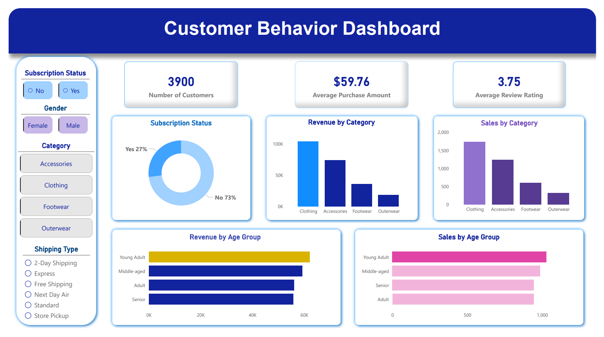

# 🛍️ Customer Shopping Behavior – Retail Data Analytics

_Analyzing customer purchasing patterns and shopping behavior to support data-driven business decisions using Python, SQL, and Power BI._

---

## 📌 Table of Contents
- <a href="#overview">Overview</a>
- <a href="#business-problem">Business Problem</a>
- <a href="#dataset">Dataset</a>
- <a href="#tools--technologies">Tools & Technologies</a>
- <a href="#project-structure">Project Structure</a>
- <a href="#data-preparation">Data Preparation (Python)</a>
- <a href="#sql-analysis">SQL Analysis</a>
- <a href="#key-findings">Key Findings</a>
- <a href="#dashboard">Power BI Dashboard</a>
- <a href="#how-to-run">How to Run This Project</a>
- <a href="#recommendations">Final Recommendations</a>
- <a href="#author">Author & Contact</a>

---

<h2><a class="anchor" id="overview"></a>🔍 Overview</h2>

This project delivers an end-to-end data analytics workflow on customer shopping behavior data from **3,900 retail transactions**. The pipeline covers Python for data cleaning and feature engineering, MySQL for structured querying and business analysis, and Power BI for interactive visualization — transforming raw retail data into actionable business insights.

---

<h2><a class="anchor" id="business-problem"></a>💼 Business Problem</h2>

> _"How can the company leverage consumer shopping data to identify trends, improve customer engagement, and optimize marketing and product strategies?"_

A leading retail company wants to better understand its customers' shopping behavior in order to improve sales, customer satisfaction, and long-term loyalty. Management has noticed changes in purchasing patterns across demographics, product categories, and sales channels. They are particularly interested in uncovering which factors — discounts, reviews, seasons, or payment preferences — drive consumer decisions and repeat purchases.

**📦 Project Deliverables:**
1.  **Data Preparation & Modeling (Python)** — Clean and transform the raw dataset, engineer features, and load into MySQL
2.  **Data Analysis (SQL)** — Run 10 queries to extract insights on customer segments, loyalty, and purchase drivers
3.  **Visualization & Insights (Power BI)** — Build an interactive dashboard with dynamic slicers
4.  **Report & Presentation** — Summarize key findings and business recommendations
5.  **GitHub Repository** — Well-structured repository for reproducibility

---

<h2><a class="anchor" id="dataset"></a>📂 Dataset</h2>

- **File:** `data/customer_shopping_behavior.csv`
- **Size:** 3,900 rows × 18 columns
- **Key stats:** Avg Purchase $59.76 · Avg Rating 3.75/5 · 27% Subscribers · 4 Product Categories

---

<h2><a class="anchor" id="tools--technologies"></a>🛠️ Tools & Technologies</h2>

| Tool | Purpose |
|------|---------|
| 🐍 **Python (pandas)** | Data cleaning, feature engineering, MySQL export |
| 📓 **Jupyter Notebook** | Python analysis environment |
| 🗄️ **MySQL** | Structured querying and business analysis (10 queries) |
| 📊 **Power BI** | Interactive dashboard and KPI reporting |
| 🔗 **SQLAlchemy + pymysql** | Python–MySQL connection |
| 🐙 **GitHub** | Version control and project sharing |

---

<h2><a class="anchor" id="project-structure"></a>📁 Project Structure</h2>

```
customer-behavior-analysis-python-sql-powerbi/
│
├── README.md
│
├── assets/                        # 🖼️ Supporting images
│   └── dashbaord.PNG
│
├── data/                          # 📂 Raw dataset
│   └── customer_shopping_behavior.csv
│
├── notebooks/                     # 📓 Jupyter notebooks
│   └── customer_shopping_analysis_eda_python.ipynb
│
├── dashboard/                     # 📊 Power BI dashboard files
│   ├── customer_behavior_powerbi.pbix
│   └── customer_behavior_powerbi_dashboard.pdf
│
├── reports/                       # 📄 Final documentation
│   ├── Customer-Shopping-Behavior-Analysis-Presentation.pdf
│   └── Customer_Shopping_Behavior_Analysis_Report.pdf
│
└── sql/                           # 🗄️ SQL analysis scripts
    └── customer_behavior_sql.sql
```

---

<h2><a class="anchor" id="data-preparation"></a>🐍 Data Preparation (Python)</h2>

All data preparation was performed in the Jupyter Notebook using **pandas**:

| Step | Action | Detail |
|------|--------|--------|
| 1️⃣ | **Data Loading** | Loaded CSV with `pd.read_csv()`, inspected with `df.info()` and `df.describe()`. Confirmed 3,900 rows × 18 columns |
| 2️⃣ | **Missing Value Treatment** | Found 37 nulls in `review_rating`. Imputed using **group-wise median per Category** to preserve category-level distributions |
| 3️⃣ | **Column Standardization** | Renamed all columns to `snake_case`. Renamed `purchase_amount_(usd)` → `purchase_amount` |
| 4️⃣ | **Duplicate Column Removal** | `discount_applied` and `promo_code_used` were 100% identical — dropped `promo_code_used` |
| 5️⃣ | **Feature: `age_group`** | Applied `pd.qcut()` (4 quantile bins) → Young Adult, Adult, Middle-aged, Senior |
| 6️⃣ | **Feature: `purchase_frequency_days`** | Mapped text labels → numeric days (Weekly→7, Monthly→30, Quarterly→90, Annually→365) |
| 7️⃣ | **MySQL Export** | Connected via `SQLAlchemy + pymysql`, loaded DataFrame into `customer` table using `df.to_sql()` |

---

<h2><a class="anchor" id="sql-analysis"></a>🗄️ SQL Analysis</h2>

Ten queries executed against the MySQL `customer_behavior` database:

| # | Query | 🔑 Key Result |
|---|-------|--------------|
| 5.1 | Revenue by Gender | Male: **$157,890** · Female: **$75,191** |
| 5.2 | High-Spending Discount Users | **839 customers** used discounts yet spent above average |
| 5.3 | Top 5 Products by Rating | Gloves ⭐3.86 · Sandals ⭐3.84 · Boots ⭐3.82 |
| 5.4 | Shipping Type Comparison | Express avg **$60.48** vs Standard **$58.46** |
| 5.5 | Subscribers vs Non-Subscribers | 1,053 Yes / 2,847 No — nearly identical avg spend |
| 5.6 | Discount-Dependent Products | Hat **50%** · Sneakers **49.66%** · Coat **49.07%** |
| 5.7 | Customer Segmentation | Loyal **79.9%** · Returning **18%** · New **2.1%** |
| 5.8 | Top 3 Products per Category | Jewelry & Blouse lead with **171 orders** each |
| 5.9 | Repeat Buyers & Subscriptions | **72.44%** of repeat buyers have NOT subscribed |
| 5.10 | Revenue by Age Group | Young Adult **$62,143** · Middle-aged **$59,197** |

---

<h2><a class="anchor" id="key-findings"></a>💡 Key Findings</h2>

1. 👥 **Gender Revenue Gap** — Male customers generate 2.1× more total revenue ($157,890 vs $75,191), likely due to a larger share in the dataset rather than higher per-transaction spend.
2. 🔔 **Subscription Program Under-Leveraged** — 72% of repeat buyers (2,518 customers) have not subscribed, representing a major missed retention opportunity.
3. 🏷️ **Discount Over-Dependency** — Hat, Sneakers, and Coat have ~50% of purchases discounted, eroding margins with always-on promotions.
4. 🏆 **Loyalty Base is Strong, Acquisition is Weak** — 79.9% of customers are already Loyal, but only 2.1% are New — the acquisition funnel is critically narrow.
5. ⭐ **Consistent Product Quality** — Top-rated products cluster tightly between 3.78–3.86, indicating reliable quality across all categories.

---

<h2><a class="anchor" id="dashboard"></a>📊 Power BI Dashboard</h2>

The interactive Power BI dashboard includes:
- 📌 **KPI cards** — Total Customers, Avg Purchase Amount, Avg Review Rating
- 🍩 **Subscription Status** — Donut chart (Yes 27% / No 73%)
- 📦 **Revenue by Category** — Bar chart across Clothing, Accessories, Footwear, Outerwear
- 👥 **Revenue & Sales by Age Group** — Young Adult leads both metrics
- 🎛️ **Dynamic slicers** — Filter by Subscription Status, Gender, Category, Shipping Type



---

<h2><a class="anchor" id="how-to-run"></a>▶️ How to Run This Project</h2>

**1. Clone the repository:**
```bash
git clone https://github.com/shubham-rajendra-patil/customer-behavior-analysis-python-sql-powerbi.git
```

**2. Install required Python libraries:**
```bash
pip install pandas sqlalchemy pymysql
```

**3. 🐍 Run Python Data Preparation:**
- Open `notebooks/customer_shopping_analysis_eda_python.ipynb`
- Run all cells to clean data, engineer features, and export to MySQL

**4. 🗄️ Set up MySQL:**
- Create a database named `customer_behavior`
- The notebook will auto-create the `customer` table via `df.to_sql()`
- Execute additional queries from `sql/customer_behavior_sql.sql`

**5. 📊 Open Power BI Dashboard:**
- Open `dashboard/customer_behavior_powerbi.pbix` in Power BI Desktop
- Refresh data connection to MySQL if required

**6. 📄 View Report:**
- `reports/Customer_Shopping_Behavior_Analysis_Report.pdf`

---

<h2><a class="anchor" id="recommendations"></a>🎯 Final Recommendations</h2>

| # | Recommendation | Based On |
|---|---------------|----------|
| 1 | 🔔 **Boost Subscription Program** — Target 2,518 non-subscribed repeat buyers with a free 1-month trial and exclusive benefits | Q5.9: 72.44% repeat buyers unsubscribed |
| 2 | 🏷️ **Review Discount Policy** — Switch to time-limited flash discounts for Hat, Sneakers & Coat | Q5.6: ~50% discount dependency |
| 3 | 👤 **Activate Returning Customers** — Deploy targeted email sequence for the 701 Returning segment | Q5.7: 18% stuck in Returning tier |
| 4 | ⭐ **Spotlight Top-Rated Products** — Feature Gloves, Sandals & Boots in hero banners with star ratings | Q5.3: Ratings 3.82–3.86 |
| 5 | 📢 **Expand Customer Acquisition** — Invest in paid ads & referral programs to widen the funnel | Q5.7: Only 2.1% New customers |

---

<h2><a class="anchor" id="author"></a>👤 Author & Contact</h2>

**Shubham Rajendra Patil**

[](https://github.com/shubham-rajendra-patil)
[](https://www.linkedin.com/in/shubham-rajendra-patil)

---
